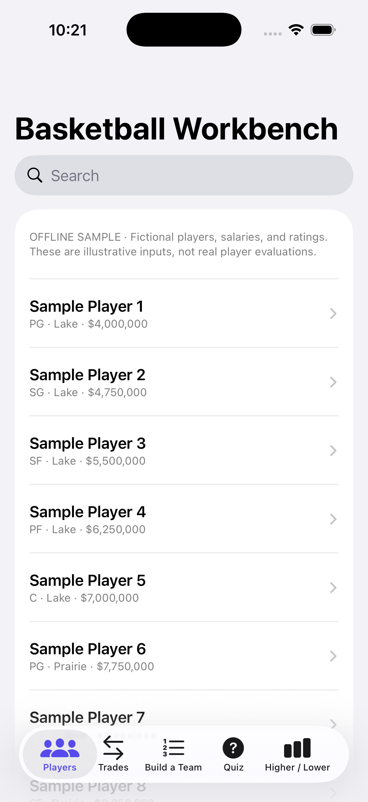
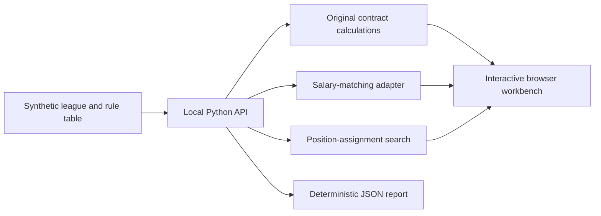

# Basketball Application

Basketball decisions cross several kinds of information: player contributions, positional fit, salaries, and transaction constraints. This project connects those concerns in an inspectable application, with a working offline edition and a preserved history of the broader Swift implementation.

**Run it now:** explore **24 fictional players on four teams**, compare a trade's two salary-matching checks, assemble a five-player lineup, and inspect a contract calculation. The included example reports a passing trade, a failing trade, and a complete positional assignment. Every input in the public demonstration is synthetic.

**My contribution — Shawn Vazin:** application modeling, player and team exploration, trade and contract logic, lineup tools, and iterative development around concrete user needs. The [user-story record](docs/user-stories.md) links those needs to genuine development commits. The [separate PyTorch model](https://github.com/Shaboxx/basketball-player-evaluation) focuses on possession modeling and evaluation.

The repository also includes a **native SwiftUI offline application** with player exploration, original trade-compliance checks, a constrained roster draft, a seeded quiz, and a higher/lower game. Its separate fixture has **20 invented players across four teams**. [Native setup and implementation scope](ios/README.md) · [Computed native example](ios/OfflineExample.json).



Actual iOS simulator capture from the [verified native build and launch](https://github.com/Shaboxx/basketball-app/actions/runs/35541272821). The displayed records are synthetic.

## Run the offline application

Requirements: Python **3.12+**, a modern browser, and roughly **100 MB RAM**. The browser edition uses the standard library, has no third-party installation requirements, and requires no account or network service.

```bash
git clone https://github.com/Shaboxx/basketball-app.git
cd basketball-app
python -m venv .venv
```

Activate with `.venv\Scripts\Activate.ps1` in PowerShell or `source .venv/bin/activate` on macOS/Linux. Then:

```bash
python app.py --demo
python -m unittest discover -s tests -v
python app.py
```

Open **http://127.0.0.1:8765**. The server binds only to your machine. Stop it with Ctrl+C. `--port 8766` selects another port. The first command prints the results and writes [examples/demo-report.json](examples/demo-report.json).

Try these paths:

1. **Explore:** search for Harbor or PG in the player directory.
2. **Trade sandbox:** Harbor Player 1 for Mesa Player 1 passes both salary checks. Harbor Player 6 for Mesa Player 1 fails Harbor's incoming-salary limit.
3. **Lineup builder:** the five preselected Harbor players cover PG through C. A five-guard group cannot cover all positions.
4. **Contracts:** inspect the first-year maximum, re-signing maximum, and cap hold from the fixture's rule table.
5. **User stories:** connect application behavior with the development history.

## Implementation and boundaries



The browser workbench is a complete runnable public edition. It uses the original pure contract calculations in [`core/offseason_cba.py`](core/offseason_cba.py). Its salary matcher ports `TradeCompliance.allowedIncoming` from the retained Swift engine. The lineup builder searches for a distinct eligible player for each position rather than assigning a player twice.

The [`ios/NBATradeMachine`](ios/NBATradeMachine) tree preserves reviewed Swift application components: models, player/team views, trade constraints, lineup explanations, fantasy scoring, and deterministic basketball games. Explicit SwiftPM and Xcode targets select 75 original and offline runtime files for the runnable native application; the other components remain inspectable historical source. Live data feeds, account and hosted-session features, production configuration, and bundled real-player data are outside this public edition. Each runnable target is documented separately; the presence of a historical component does not imply that every original screen is enabled in either offline interface.

With **Swift 6.2+** installed, the original engines also run headlessly on Linux or macOS:

```bash
swift test --jobs 2
swift run --jobs 2 basketball-native --report
```

On macOS, `swift run basketball-native` opens the SwiftUI application. For iOS, open `ios/BasketballOffline.xcodeproj` in Xcode 26.3+ and run the shared **BasketballOffline** scheme in a simulator. No Firebase setup, account, signing identity, or data subscription is needed for the simulator. [Native details](ios/README.md) distinguish the offline target from the broader retained source.

The public browser trade tool checks **one-for-one salary matching only**. It does not check every roster, pick, exception, timing, or transaction rule implemented elsewhere in the Swift code. “Pass” is scoped to the displayed salary check. The historical constants are preserved as implementation evidence; the example's cap table is fictional and is not presented as current league policy.

## Evaluation

| Check | Input / comparison | Reproduced output |
| --- | --- | --- |
| Salary matching | Original Swift formula port; boundary cases for five cap tiers | Expected limits, both pass and fail scenarios |
| Contracts | Explicit synthetic rule table; service-year and tenure boundaries | Correct tier transitions, minimum clamping, alternative maximum, cap hold |
| Lineup | Five eligible positions versus five guards; duplicate guard | Complete distinct assignment or a clear incomplete result |
| Application | HTTP fixture fetch, trade POST, invalid request, and protected-path checks | Structured results and expected errors |
| Browser interaction | Search, trade evaluation, lineup and contract workflows | Outputs computed by the local API |

The automated Python suite contains **seven tests** covering domain boundaries and real HTTP requests. These are functional checks, not a measured business result or a claim of predictive basketball accuracy. Offense/defense values in the browser are invented inputs; lineup means ignore player interactions. The separate model repository contains the machine-learning evaluation.

The native suite contains **333 tests**, including retained original engine regressions and seven new offline integration checks. It covers the actual Swift trade, player, and deterministic game logic. The native CLI demonstrates a completed constrained draft, an eight-question quiz, and salary matching from the original engine. CI runs the Python application, the Swift suite on Linux and macOS, and an iOS simulator build and launch.

## Authentic history

The public history retains **377 relevant development commits** from **May–August 2026**, selected by an explicit file allowlist. Original author dates and commit descriptions are preserved. Filtering changes commit hashes and removes commits with no retained changes. Preview-only blocks containing named real-player fixtures were removed throughout the retained history; the application code before those blocks is preserved unchanged. The histories may mention features beyond the offline target because the corresponding development work was broader than this release.

The offline browser edition, fixture, public documentation, and CI were added on **September 20, 2026** in commits describing actual release work. The user stories were organized retrospectively from implementation evidence; they are not backdated planning artifacts. See [user stories and commit links](docs/user-stories.md).

## Data and license

The included [synthetic league](data/synthetic-league.json) contains four invented teams and 24 invented players. Payroll includes fictional roster members not listed in the compact fixture. No proprietary player feeds, media, cached ratings, or model checkpoints are included. [Data contracts](docs/data-contract.md) describe each input and output.

No open-source license is currently granted for the original work. [License status](LICENSE_STATUS.md) and [third-party notices](THIRD_PARTY_NOTICES.md) describe the applicable boundaries.
